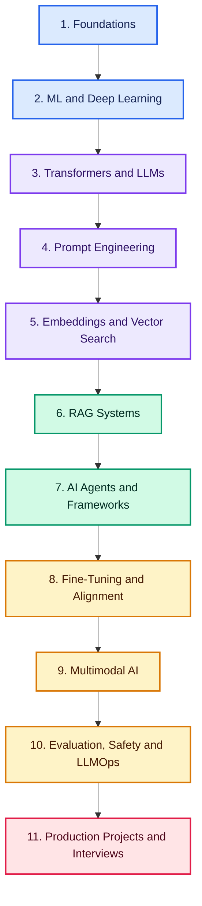
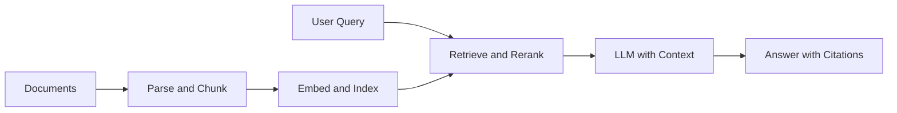

# 🤖 Generative AI Roadmap: Beginner to Production

> A practical, project-based path to master Generative AI, Large Language Models (LLMs), RAG, AI agents, fine-tuning, multimodal AI, evaluation, safety, and production deployment.

## 🎯 What You Will Learn

- Understand AI, ML, deep learning, transformers, and LLM fundamentals.
- Build reliable prompts, structured outputs, and tool-calling workflows.
- Create semantic search and production-ready RAG applications.
- Design single-agent and multi-agent systems with memory and guardrails.
- Fine-tune, evaluate, secure, deploy, monitor, and optimize GenAI systems.
- Build a portfolio of real-world projects and prepare for GenAI interviews.

## ✅ Prerequisites

| Skill | Recommended knowledge | Resource |
|---|---|:---:|
| Python | Variables, functions, classes, packages, virtual environments | [Article](https://tech.examadda.org/python) |
| Mathematics | Vectors, matrices, probability, derivatives, cosine similarity | [Article](https://tech.examadda.org/machine-learning) |
| APIs | HTTP, REST, JSON, authentication, error handling | [Article](https://tech.examadda.org/backend-development) |
| Git | Clone, branch, commit, pull request | [Practice](https://github.com/ExamAdda) |
| Optional | Basic ML and cloud knowledge | [Roadmap](https://tech.examadda.org/machine-learning/roadmap) |

## 🗺️ Complete Learning Path

> Follow the phases in order. Complete at least one practice task and one project checkpoint before advancing.

## Phase 1 — AI and Generative AI Foundations

**Goal:** Understand what GenAI is, how it differs from traditional AI, and how modern applications use foundation models.

| Topic | Article | Video lesson | Practice / Quiz | Project checkpoint |
|---|:---:|:---:|:---:|:---:|
| Introduction to Artificial Intelligence | [Read](https://tech.examadda.org/genai/introduction-to-artificial-intelligence) | [Watch](VIDEO_URL) | [Quiz](QUIZ_URL) | — |
| Introduction to Generative AI | [Read](https://tech.examadda.org/genai/introduction-to-generative-ai) | [Watch](VIDEO_URL) | [Practice](PRACTICE_URL) | [AI use-case explorer](PROJECT_URL) |
| History and evolution of GenAI | [Read](https://tech.examadda.org/genai/history-of-generative-ai-1) | [Watch](VIDEO_URL) | [Revision](REVISION_URL) | — |
| Discriminative vs generative models | [Read](ARTICLE_URL) | [Watch](VIDEO_URL) | [Quiz](QUIZ_URL) | — |
| Foundation models and model lifecycle | [Read](ARTICLE_URL) | [Watch](VIDEO_URL) | [Practice](PRACTICE_URL) | — |
| Training vs inference | [Read](https://tech.examadda.org/genai/training-vs-inference-in-generative-ai) | [Watch](VIDEO_URL) | [Quiz](QUIZ_URL) | — |
| Parameters, model size, compute and GPUs | [Read](https://tech.examadda.org/genai/parameters-and-model-size) | [Watch](VIDEO_URL) | [Revision](REVISION_URL) | — |

## Phase 2 — Machine Learning and Deep Learning

**Goal:** Learn only the ML and deep-learning concepts needed to understand GenAI models.

| Module | Topics | Article | Video | Practice / Project |
|---|---|:---:|:---:|:---:|
| ML foundations | Supervised, unsupervised and reinforcement learning | [Read](https://tech.examadda.org/genai/introduction-to-machine-learning-1) | [Watch](VIDEO_URL) | [Quiz](QUIZ_URL) |
| Generalization | Training, validation, overfitting, underfitting and regularization | [Read](https://tech.examadda.org/genai/overfitting-and-underfitting) | [Watch](VIDEO_URL) | [Experiment](PRACTICE_URL) |
| Neural networks | Neurons, layers, weights, forward and backward propagation | [Read](https://tech.examadda.org/genai/neural-networks) | [Watch](VIDEO_URL) | [Build a neural network](PROJECT_URL) |
| Training | Activation functions, loss functions, optimizers and gradient descent | [Read](https://tech.examadda.org/genai/loss-functions-in-deep-learning) | [Watch](VIDEO_URL) | [Practice](PRACTICE_URL) |
| Sequence models | RNN, LSTM, attention motivation and limitations | [Read](https://tech.examadda.org/genai/cnn-rnn-and-lstm) | [Watch](VIDEO_URL) | [Quiz](QUIZ_URL) |
| Generative families | Autoencoders, VAEs, GANs and diffusion models | [Compare](https://tech.examadda.org/genai/generative-ai-model-comparison) | [Watch](VIDEO_URL) | [Image generator](PROJECT_URL) |
| Ecosystem | PyTorch, Hugging Face, datasets and model hubs | [Read](https://tech.examadda.org/genai/hugging-face-for-generative-ai) | [Watch](VIDEO_URL) | [Notebook](PRACTICE_URL) |

## Phase 3 — Transformers and Large Language Models

**Goal:** Understand how transformers process language and how LLMs generate output.

| Module | Topics | Article | Video | Practice / Project |
|---|---|:---:|:---:|:---:|
| Text representation | Tokens, tokenizers, vocabulary and embeddings | [Read](https://tech.examadda.org/genai/tokenizers) | [Watch](VIDEO_URL) | [Tokenizer visualizer](PROJECT_URL) |
| Transformer input | Token embeddings and positional encoding | [Read](https://tech.examadda.org/genai/positional-encoding) | [Watch](VIDEO_URL) | [Practice](PRACTICE_URL) |
| Attention | Self-attention, Q/K/V, scaled dot-product and multi-head attention | [Read](https://tech.examadda.org/genai/self-attention) | [Watch](VIDEO_URL) | [Attention calculator](PROJECT_URL) |
| Architecture | Encoder, decoder, FFN, residual connections and normalization | [Read](https://tech.examadda.org/genai/transformer-architecture) | [Watch](VIDEO_URL) | [Label the architecture](QUIZ_URL) |
| Model families | BERT, GPT and T5; encoder vs decoder vs encoder-decoder | [Read](https://tech.examadda.org/genai/bert-encoder) | [Watch](VIDEO_URL) | [Comparison](PRACTICE_URL) |
| LLM training | Pretraining, next-token prediction, instruction tuning and alignment | [Read](https://tech.examadda.org/genai/next-token-prediction) | [Watch](VIDEO_URL) | [Quiz](QUIZ_URL) |
| Inference controls | Temperature, top-k, top-p, max tokens and stop sequences | [Read](https://tech.examadda.org/genai/temperature) | [Watch](VIDEO_URL) | [Generation playground](PROJECT_URL) |
| Capabilities and limits | Context windows, scaling laws, hallucinations and reasoning limits | [Read](https://tech.examadda.org/genai/hallucinations-in-llms) | [Watch](VIDEO_URL) | [Failure analysis](PRACTICE_URL) |
| Model selection | Proprietary vs open models, quality, latency, privacy and cost | [Read](https://tech.examadda.org/genai/open-source-llms) | [Watch](VIDEO_URL) | [Decision matrix](PROJECT_URL) |

## Phase 4 — Prompt Engineering and Model APIs

**Goal:** Build dependable LLM interactions rather than isolated demo prompts.

| Module | Topics | Article | Video | Practice / Project |
|---|---|:---:|:---:|:---:|
| Prompt anatomy | System, developer, user and assistant messages; context and constraints | [Read](https://tech.examadda.org/genai/introduction-to-prompts) | [Watch](VIDEO_URL) | [Prompt lab](PRACTICE_URL) |
| Prompting techniques | Zero-shot, one-shot, few-shot and role prompting | [Read](https://tech.examadda.org/genai/few-shot-prompting) | [Watch](VIDEO_URL) | [Quiz](QUIZ_URL) |
| Reasoning workflows | Decomposition, self-consistency, reflection and ReAct | [Read](https://tech.examadda.org/genai/react-prompting) | [Watch](VIDEO_URL) | [Reasoning benchmark](PROJECT_URL) |
| Structured output | JSON schema, validation, retries and output parsing | [Read](https://tech.examadda.org/genai/json-output-prompting) | [Watch](VIDEO_URL) | [Data extractor](PROJECT_URL) |
| Tools | Function calling, tool calling and API integration | [Read](https://tech.examadda.org/genai/function-calling) | [Watch](VIDEO_URL) | [Weather assistant](PROJECT_URL) |
| Reliability | Prompt injection awareness, delimiters, grounding and guardrails | [Read](ARTICLE_URL) | [Watch](VIDEO_URL) | [Red-team prompts](PRACTICE_URL) |
| API engineering | Streaming, retries, timeouts, rate limits, caching and cost tracking | [Read](ARTICLE_URL) | [Watch](VIDEO_URL) | [Production chat API](PROJECT_URL) |

## Phase 5 — Embeddings and Vector Databases

**Goal:** Build semantic search and prepare the retrieval layer used by RAG.

| Module | Topics | Article | Video | Practice / Project |
|---|---|:---:|:---:|:---:|
| Embeddings | Dense vectors, semantic meaning and embedding dimensions | [Read](https://tech.examadda.org/genai/introduction-to-embeddings) | [Watch](VIDEO_URL) | [Embedding explorer](PROJECT_URL) |
| Similarity | Cosine similarity, dot product and Euclidean distance | [Read](https://tech.examadda.org/genai/cosine-similarity) | [Watch](VIDEO_URL) | [Calculate](PRACTICE_URL) |
| Embedding models | OpenAI, Sentence Transformers, BGE and E5 | [Read](https://tech.examadda.org/genai/sentence-transformers) | [Watch](VIDEO_URL) | [Model comparison](PROJECT_URL) |
| Vector indexing | KNN, ANN, HNSW, IVF and top-k retrieval | [Read](https://tech.examadda.org/genai/approximate-nearest-neighbor-ann-search) | [Watch](VIDEO_URL) | [Quiz](QUIZ_URL) |
| Vector stores | FAISS, Chroma, Pinecone, Weaviate and pgvector | [Read](https://tech.examadda.org/genai/introduction-to-vector-databases) | [Watch](VIDEO_URL) | [Semantic search](PROJECT_URL) |
| Retrieval quality | Metadata filters, hybrid search, reranking and caching | [Read](https://tech.examadda.org/genai/hybrid-search) | [Watch](VIDEO_URL) | [Retrieval benchmark](PROJECT_URL) |

## Phase 6 — Retrieval-Augmented Generation (RAG)

**Goal:** Build a grounded question-answering system with measurable retrieval and answer quality.

| Module | Topics | Article | Video | Practice / Project |
|---|---|:---:|:---:|:---:|
| RAG fundamentals | Architecture, use cases, benefits and limitations | [Read](https://tech.examadda.org/genai/introduction-to-rag) | [Watch](VIDEO_URL) | [Architecture quiz](QUIZ_URL) |
| Ingestion | Loaders, parsing, cleaning, chunking, overlap and metadata | [Read](https://tech.examadda.org/genai/document-chunking) | [Watch](VIDEO_URL) | [Ingestion pipeline](PROJECT_URL) |
| Retrieval | Vector, keyword, hybrid, multi-query and parent-child retrieval | [Read](https://tech.examadda.org/genai/multi-query-retrieval) | [Watch](VIDEO_URL) | [Retriever comparison](PROJECT_URL) |
| Advanced RAG | Query rewriting, reranking, contextual compression and Graph RAG | [Read](https://tech.examadda.org/genai/graph-rag) | [Watch](VIDEO_URL) | [Advanced RAG](PROJECT_URL) |
| Generation | Context assembly, citations, abstention and conversation history | [Read](ARTICLE_URL) | [Watch](VIDEO_URL) | [PDF Q&A assistant](PROJECT_URL) |
| Evaluation | Recall@k, precision@k, MRR, faithfulness, relevance and groundedness | [Read](https://tech.examadda.org/genai/faithfulness-rag) | [Watch](VIDEO_URL) | [RAG evaluation suite](PROJECT_URL) |
| Production | Access control, incremental indexing, observability, caching and cost | [Read](ARTICLE_URL) | [Watch](VIDEO_URL) | [Production RAG API](PROJECT_URL) |

## Phase 7 — AI Agents and Agent Frameworks

**Goal:** Create agents that plan, use tools, preserve state, recover from failure, and request human approval when needed.

| Module | Topics | Article | Video | Practice / Project |
|---|---|:---:|:---:|:---:|
| Agent fundamentals | Agent loop, reasoning, planning, actions and observations | [Read](https://tech.examadda.org/genai/introduction-to-ai-agents) | [Watch](VIDEO_URL) | [Quiz](QUIZ_URL) |
| Tools | Function calls, APIs, search, databases and code execution | [Read](https://tech.examadda.org/genai/tools-ai-agents) | [Watch](VIDEO_URL) | [Tool-using assistant](PROJECT_URL) |
| Memory and state | Working, episodic and semantic memory; checkpoints | [Read](https://tech.examadda.org/genai/memory-ai-agents) | [Watch](VIDEO_URL) | [Memory assistant](PROJECT_URL) |
| Agent patterns | ReAct, plan-and-execute, routing, reflection and evaluator-optimizer | [Read](https://tech.examadda.org/genai/react-agent-pattern) | [Watch](VIDEO_URL) | [Pattern comparison](PRACTICE_URL) |
| Workflows | Deterministic flows, human-in-the-loop, retries and durable execution | [Read](https://tech.examadda.org/genai/langgraph-workflow-design) | [Watch](VIDEO_URL) | [Approval workflow](PROJECT_URL) |
| Multi-agent systems | Roles, delegation, communication, orchestration and shared state | [Read](https://tech.examadda.org/genai/agent-orchestration-in-ai-agents) | [Watch](VIDEO_URL) | [Research team](PROJECT_URL) |
| Frameworks | LangChain, LlamaIndex and LangGraph | [Read](https://tech.examadda.org/genai/introduction-to-langgraph) | [Watch](VIDEO_URL) | [Framework lab](PRACTICE_URL) |
| Agent protocols | Model Context Protocol (MCP), resources, prompts and tools | [Read](ARTICLE_URL) | [Watch](VIDEO_URL) | [MCP server](PROJECT_URL) |
| Safety | Least privilege, sandboxing, approvals, audit logs and prompt injection | [Read](ARTICLE_URL) | [Watch](VIDEO_URL) | [Agent threat model](PROJECT_URL) |

## Phase 8 — Fine-Tuning and Model Alignment

**Goal:** Know when fine-tuning is justified and build a reproducible adaptation pipeline.

| Module | Topics | Article | Video | Practice / Project |
|---|---|:---:|:---:|:---:|
| Strategy | Prompting vs RAG vs fine-tuning | [Read](https://tech.examadda.org/genai/introduction-to-tuning) | [Watch](VIDEO_URL) | [Decision exercise](PRACTICE_URL) |
| Data | Collection, cleaning, deduplication, formatting and train/validation/test splits | [Read](https://tech.examadda.org/genai/data-collection-for-fine-tuning) | [Watch](VIDEO_URL) | [Prepare a dataset](PROJECT_URL) |
| Methods | Full fine-tuning, instruction tuning, LoRA, QLoRA and PEFT | [Read](https://tech.examadda.org/genai/lora-low-rank-adaptation) | [Watch](VIDEO_URL) | [LoRA notebook](PROJECT_URL) |
| Alignment | SFT, preference data, RLHF and DPO concepts | [Read](ARTICLE_URL) | [Watch](VIDEO_URL) | [Quiz](QUIZ_URL) |
| Evaluation | Baselines, task metrics, human evaluation and regression testing | [Read](https://tech.examadda.org/genai/benchmarks-for-fine-tuning) | [Watch](VIDEO_URL) | [Model comparison](PROJECT_URL) |
| Serving | Quantization, model formats, inference servers and adapters | [Read](ARTICLE_URL) | [Watch](VIDEO_URL) | [Serve a tuned model](PROJECT_URL) |

## Phase 9 — Multimodal and Generative Media

**Goal:** Build applications that understand or generate combinations of text, image, audio, and video.

| Module | Topics | Article | Video | Practice / Project |
|---|---|:---:|:---:|:---:|
| Multimodal foundations | Encoders, shared representation, cross-attention and fusion | [Read](https://tech.examadda.org/genai/introduction-to-multimodal-ai) | [Watch](VIDEO_URL) | [Quiz](QUIZ_URL) |
| Vision-language models | Image understanding, OCR, visual Q&A and document AI | [Read](https://tech.examadda.org/genai/image-modality) | [Watch](VIDEO_URL) | [Invoice extractor](PROJECT_URL) |
| Image generation | Diffusion, text-to-image, image editing and control techniques | [Read](https://tech.examadda.org/genai/diffusion-models) | [Watch](VIDEO_URL) | [Image studio](PROJECT_URL) |
| Speech and audio | Speech-to-text, text-to-speech, audio understanding and voice safety | [Read](https://tech.examadda.org/genai/audio-modality) | [Watch](VIDEO_URL) | [Voice assistant](PROJECT_URL) |
| Video | Video understanding and generation fundamentals | [Read](ARTICLE_URL) | [Watch](VIDEO_URL) | [Video summarizer](PROJECT_URL) |
| Multimodal RAG | Retrieve text, tables and images from complex documents | [Read](ARTICLE_URL) | [Watch](VIDEO_URL) | [Document analyst](PROJECT_URL) |

## Phase 10 — Evaluation, Safety, LLMOps and Deployment

**Goal:** Move from a working prototype to a reliable, secure, observable, and cost-efficient system.

| Module | Topics | Article | Video | Practice / Project |
|---|---|:---:|:---:|:---:|
| Evaluation | Golden datasets, offline/online evaluation, LLM-as-judge and human review | [Read](ARTICLE_URL) | [Watch](VIDEO_URL) | [Evaluation harness](PROJECT_URL) |
| Safety | Harmful content, bias, privacy, PII, moderation and responsible AI | [Read](ARTICLE_URL) | [Watch](VIDEO_URL) | [Safety checklist](PRACTICE_URL) |
| Security | Prompt injection, data exfiltration, insecure tools and supply-chain risks | [Read](ARTICLE_URL) | [Watch](VIDEO_URL) | [Red-team lab](PROJECT_URL) |
| Observability | Traces, prompts, token usage, latency, errors and quality monitoring | [Read](ARTICLE_URL) | [Watch](VIDEO_URL) | [Monitoring dashboard](PROJECT_URL) |
| Performance | Streaming, batching, caching, routing, fallbacks and semantic cache | [Read](ARTICLE_URL) | [Watch](VIDEO_URL) | [Optimization lab](PROJECT_URL) |
| Deployment | Docker, CI/CD, serverless, GPU serving, autoscaling and secrets | [Read](ARTICLE_URL) | [Watch](VIDEO_URL) | [Deploy an AI API](PROJECT_URL) |
| Governance | Versioning, audit trails, access policies, licenses and data retention | [Read](ARTICLE_URL) | [Watch](VIDEO_URL) | [Governance plan](PROJECT_URL) |

## 🚀 Portfolio Projects

| Level | Project | Core skills | Deliverables |
|:---:|---|---|---|
| 🟢 Beginner | AI text summarizer | Prompting, APIs, structured output | App, README, test cases |
| 🟢 Beginner | Resume feedback assistant | Prompt design, schemas, guardrails | Web UI, scoring rubric |
| 🟡 Intermediate | Semantic search engine | Embeddings, vector database, filters | Search API, evaluation set |
| 🟡 Intermediate | Chat with PDFs | Chunking, RAG, citations, history | Full-stack RAG application |
| 🟡 Intermediate | SQL analytics assistant | Tool calling, validation, permissions | Read-only database agent |
| 🟠 Advanced | Customer-support copilot | Hybrid retrieval, reranking, escalation | Production-style service |
| 🟠 Advanced | Multi-agent research system | Planning, tools, delegation, state | Traced agent workflow |
| 🔴 Expert | Domain-tuned LLM | Dataset design, LoRA/QLoRA, evaluation | Adapter, model card, benchmark |
| 🔴 Expert | Multimodal document analyst | OCR, vision-language model, RAG | Document processing platform |
| 🔴 Expert | Production GenAI platform | Gateway, evaluation, safety, LLMOps | Deployed, monitored capstone |

## 💼 Interview Preparation

| Level | Resource | Recommended stage |
|:---:|---|---|
| 🟢 Beginner | [Beginner GenAI Interview Questions](https://tech.examadda.org/genai/beginner-interview-questions) | After Phase 3 |
| 🟡 Intermediate | [Intermediate GenAI Interview Questions](https://tech.examadda.org/genai/intermediate-interview-questions) | After Phase 6 |
| 🔴 Advanced | [Advanced GenAI Interview Questions](https://tech.examadda.org/genai/advanced-interview-questions) | After Phase 10 |
| 🟣 Scenario-based | [Scenario-Based GenAI Interview Questions](https://tech.examadda.org/genai/scenario-based-interview-questions) | During capstone preparation |

Focus on explaining trade-offs: model selection, prompting vs RAG vs fine-tuning, chunking strategy, retrieval quality, hallucination control, evaluation, latency, security, and cost.

## 📅 Suggested Study Plan

| Track | Duration | Weekly commitment | Best for |
|---|:---:|:---:|---|
| Fast track | 12 weeks | 15–20 hours | Developers building GenAI apps quickly |
| Balanced | 20 weeks | 8–12 hours | Working professionals |
| In-depth | 32 weeks | 5–8 hours | Learners including ML theory and fine-tuning |

### 20-Week Balanced Plan

| Weeks | Focus | Milestone |
|:---:|---|---|
| 1–2 | Foundations, ML and deep learning | Neural-network mini project |
| 3–5 | Transformers, LLMs and prompting | Structured-output application |
| 6–7 | Embeddings and vector databases | Semantic search engine |
| 8–10 | RAG and evaluation | RAG app with citations |
| 11–13 | Agents and frameworks | Tool-using agent |
| 14–15 | Fine-tuning and alignment | LoRA experiment |
| 16–17 | Multimodal AI | Multimodal mini project |
| 18–19 | Safety, evaluation and LLMOps | Production readiness report |
| 20 | Capstone and interview revision | Demo, README and case study |

## ✅ Completion Checklist

- [ ] Finish every core article and video lesson.
- [ ] Score at least 80% in phase quizzes.
- [ ] Complete practice exercises without copying the solution.
- [ ] Build at least three mini projects and one production-style capstone.
- [ ] Add evaluation datasets, automated tests, security controls, and cost metrics.
- [ ] Publish clear READMEs with architecture, setup, trade-offs, results, and demos.
- [ ] Revise beginner, intermediate, advanced, and scenario-based interview questions.

## 🔖 Resource Link Convention

Replace these placeholders as content becomes available:

- `ARTICLE_URL` — detailed ExamAdda tutorial.
- `VIDEO_URL` — complete video lesson or solution.
- `PRACTICE_URL` — hands-on lab or coding exercise.
- `QUIZ_URL` — topic assessment.
- `REVISION_URL` — notes, flashcards, or cheat sheet.
- `PROJECT_URL` — guided project, starter repository, or solution.

---

## 🌟 Learn with ExamAdda

- [Explore Generative AI Tutorials](https://tech.examadda.org/genai)
- [Open the Interactive GenAI Roadmap](https://tech.examadda.org/genai/roadmap)
- [View ExamAdda on GitHub](https://github.com/ExamAdda)
- [Explore ExamAdda Premium](https://examadda.org/premium)

> Learn the concept, watch the implementation, practise it yourself, build a project, evaluate the result, and then explain the trade-offs.

## Contributing

Corrections, explanations, test cases and implementations are welcome. Read [CONTRIBUTING.md](CONTRIBUTING.md) before opening a pull request.

## About ExamAdda

[ExamAdda](https://examadda.org) is an all-in-one platform for mastering DSA, system design, development skills, and coding interviews through structured courses, hands-on practice, company-wise questions, and mock interviews.

**Learn smarter. Practice consistently. Crack top tech interviews.**

[Start Learning](https://tech.examadda.org/) • [Explore Courses](https://tech.examadda.org/courses/) • [Unlock ExamAdda Premium](https://examadda.org/premium)

## License

This repository is available under the [MIT License](LICENSE).
