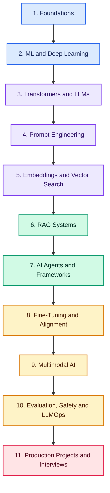

# Generative AI Roadmap: From Beginner to Production-Ready AI Engineer

> A complete, project-based learning path covering Generative AI, Large Language Models (LLMs), prompt engineering, RAG, AI agents, fine-tuning, multimodal AI, evaluation, safety, and production deployment

## Quick Roadmap

**Foundations:** [Basic GenAI](#basic-genai) • [LLMs](#llm) • [Transformer Models](#transformer-models) • [Prompt Engineering](#prompt-engineering)

**Build AI Systems:** [Embeddings](#embeddings) • [Vector Databases](#vector-databases) • [RAG](#rag) • [AI Agents](#ai-agents) • [Agent Frameworks](#agent-frameworks)

**Advanced Skills:** [Fine-Tuning](#fine-tuning) • [Multimodal AI](#multimodal-ai) • [Portfolio Projects](#portfolio-projects)

**Career Path:** [20-Week Learning Plan](#20-week-balanced-learning-plan) • [Interview Preparation](INTERVIEWS.md) • [Contributing Guide](CONTRIBUTING.md)

## Why Learn Generative AI?

Generative AI is changing how software, automation, and digital products are built. Learning it helps you create intelligent applications, solve real-world problems, and prepare for growing AI engineering opportunities.

## Build Job-Ready Generative AI Skills

Go beyond theory and learn how to:

- Work with LLMs and prompt engineering
- Build RAG applications and AI agents
- Fine-tune and optimize language models
- Create multimodal AI applications
- Evaluate, secure, and monitor AI systems
- Deploy scalable, production-ready solutions
- Build portfolio projects and prepare for interviews

> **Learn the concepts. Build real projects. Become production-ready.**

Follow the roadmap in order, starting with AI and LLM fundamentals before moving into RAG, agents, fine-tuning, evaluation, security, and deployment.

## Complete Learning Path

### Basic GenAI

- [Roadmap](https://tech.examadda.org/genai/roadmap)
- [Beginner Interview Questions](https://tech.examadda.org/genai/beginner-interview-questions)
- [Intermediate Interview Questions](https://tech.examadda.org/genai/intermediate-interview-questions)
- [Advanced Interview Questions](https://tech.examadda.org/genai/advanced-interview-questions)
- [Scenario-Based Interview Questions](https://tech.examadda.org/genai/scenario-based-interview-questions)
- [Introduction of AI](https://tech.examadda.org/genai/introduction-to-artificial-intelligence)
- [Introduction of GenAI](https://tech.examadda.org/genai/introduction-to-generative-ai)
- [History of GenAI](https://tech.examadda.org/genai/history-of-generative-ai-1)

- ML in GenAI

  - [Introduction of ML](https://tech.examadda.org/genai/introduction-to-machine-learning-1)
  - [Supervised Learning](https://tech.examadda.org/genai/supervised-learning-1)
  - [Unsupervised Learning](https://tech.examadda.org/genai/unsupervised-learning)
  - [Reinforcement Learning](https://tech.examadda.org/genai/reinforcement-learning)
  - [Overfitting & Underfitting](https://tech.examadda.org/genai/overfitting-and-underfitting)
  - [Model Evaluation Basics](https://tech.examadda.org/genai/model-evaluation-basics)
  
- Deep Learning in GenAI

  - [Introduction to Deep Learning](https://tech.examadda.org/genai/introduction-to-deep-learning)
  - [Neural Networks](https://tech.examadda.org/genai/neural-networks)
  - [Activation Functions](https://tech.examadda.org/genai/activation-functions-in-neural-networks)
  - [Loss Functions](https://tech.examadda.org/genai/loss-functions-in-deep-learning)
  - [CNN, RNN & LSTM](https://tech.examadda.org/genai/cnn-rnn-and-lstm)

- Generative AI Models

  - [Autoencoders](https://tech.examadda.org/genai/autoencoders)
  - [Variational Autoencoders (VAE)](https://tech.examadda.org/genai/variational-autoencoders-vae)
  - [GANs (Generative Adversarial Networks)](https://tech.examadda.org/genai/generative-adversarial-networks-gans)
  - [Diffusion Models](https://tech.examadda.org/genai/diffusion-models)
  - [Model Comparison](https://tech.examadda.org/genai/generative-ai-model-comparison)

- Core GenAI

  - [Parameters & Model Size](https://tech.examadda.org/genai/parameters-and-model-size)
  - [Training vs Inference](https://tech.examadda.org/genai/training-vs-inference-in-generative-ai)
  - [Fine-Tuning Basics](https://tech.examadda.org/genai/fine-tuning-basics)
  - [GPU & Compute Fundamentals](https://tech.examadda.org/genai/gpu-and-compute-fundamentals)

- GenAI Tools & Ecosystem

  - [PyTorch](https://tech.examadda.org/genai/pytorch-for-generative-ai)
  - [TensorFlow](https://tech.examadda.org/genai/tensorflow-for-generative-ai)
  - [Hugging Face](https://tech.examadda.org/genai/hugging-face-for-generative-ai)
  - [Model Hubs & Datasets](https://tech.examadda.org/genai/model-hubs-and-datasets)

---

### LLM

- [Introduction of LLM](https://tech.examadda.org/genai/introduction-to-large-language-models)
- [Model Parameters](https://tech.examadda.org/genai/model-parameters)
- [Scaling Laws](https://tech.examadda.org/genai/scaling-laws)
- [Context Window](https://tech.examadda.org/genai/context-window)
- [Tokens](https://tech.examadda.org/genai/tokens)
- [Tokenizers](https://tech.examadda.org/genai/tokenizers)
- [Split into Tokens](https://tech.examadda.org/genai/split-into-tokens)

- Output Controls

  - [Temperature](https://tech.examadda.org/genai/temperature)
  - [Top-P](https://tech.examadda.org/genai/top-p-sampling)
  - [Top-K](https://tech.examadda.org/genai/top-k-sampling)
  - [Max Tokens](https://tech.examadda.org/genai/max-tokens)

- LLM Behavior

  - [Hallucinations](https://tech.examadda.org/genai/hallucinations-in-llms)
  - [Emergent Abilities](https://tech.examadda.org/genai/emergent-abilities-in-llms)
  - [Reasoning Limitations](https://tech.examadda.org/genai/reasoning-limitations-in-llms)

- Popular Models

  - [GPT](https://tech.examadda.org/genai/gpt)
  - [Claude](https://tech.examadda.org/genai/claude)
  - [Llama](https://tech.examadda.org/genai/llama)
  - [DeepSeek](https://tech.examadda.org/genai/deepseek)
  - [Open-source Models](https://tech.examadda.org/genai/open-source-llms)

---

### Transformer Models

- [Limitations of RNN/LSTM](https://tech.examadda.org/genai/limitations-of-rnn-and-lstm)
- [Transformer Architecture](https://tech.examadda.org/genai/transformer-architecture)
- [Attention Is All You Need](https://tech.examadda.org/genai/attention-is-all-you-need)
- [Tokens & Embeddings](https://tech.examadda.org/genai/tokens-and-embeddings)
- [Positional Encoding](https://tech.examadda.org/genai/positional-encoding)
- [Encoder & Decoder](https://tech.examadda.org/genai/encoder-and-decoder)

- Transformer Block

  - [Feed Forward Network (FFN)](https://tech.examadda.org/genai/feed-forward-network-ffn)
  - [Residual Connections](https://tech.examadda.org/genai/residual-connections)
  - [Layer Normalization](https://tech.examadda.org/genai/layer-normalization)

- Transformer Variants

  - [BERT (Encoder)](https://tech.examadda.org/genai/bert-encoder)
  - [GPT (Decoder)](https://tech.examadda.org/genai/gpt-decoder)
  - [T5 (Encoder–Decoder)](https://tech.examadda.org/genai/t5-encoder-decoder)

- Attention Mechanism

  - [Self-Attention](https://tech.examadda.org/genai/self-attention)
  - [Query, Key, Value (QKV)](https://tech.examadda.org/genai/query-key-value)
  - [Multi-Head Attention](https://tech.examadda.org/genai/multi-head-attention)
  - [Cross-Attention](https://tech.examadda.org/genai/cross-attention)

- [Next Token Prediction](https://tech.examadda.org/genai/next-token-prediction)

---

### Prompt Engineering

- [Introduction of Prompt](https://tech.examadda.org/genai/introduction-to-prompts)
- [System Prompt](https://tech.examadda.org/genai/system-prompt)
- [User Prompt](https://tech.examadda.org/genai/user-prompt)
- [Assistant Prompt](https://tech.examadda.org/genai/assistant-prompt)
- [Prompt Templates](https://tech.examadda.org/genai/prompt-templates)
- [Best Practices (Context, Constraints, Guardrails)](https://tech.examadda.org/genai/prompt-engineering-best-practices)

- Core Techniques

  - [Zero-Shot](https://tech.examadda.org/genai/zero-shot-prompting)
  - [One-Shot](https://tech.examadda.org/genai/one-shot-prompting)
  - [Few-Shot](https://tech.examadda.org/genai/few-shot-prompting)
  - [Role Prompting](https://tech.examadda.org/genai/role-prompting)
  - [Chain of Thought](https://tech.examadda.org/genai/chain-of-thought-prompting)
  - [Self-Consistency](https://tech.examadda.org/genai/self-consistency-prompting)
  - [ReAct](https://tech.examadda.org/genai/react-prompting)

- Structured Outputs

  - [JSON Output](https://tech.examadda.org/genai/json-output-prompting)
  - [Function Calling](https://tech.examadda.org/genai/function-calling)
  - [Tool Calling](https://tech.examadda.org/genai/tool-calling)

---

### Embeddings

- [Introduction of Embeddings](https://tech.examadda.org/genai/introduction-to-embeddings)
- [Text to Vectors](https://tech.examadda.org/genai/text-to-vectors)
- [Semantic Similarity](https://tech.examadda.org/genai/semantic-similarity)
- [Cosine Similarity](https://tech.examadda.org/genai/cosine-similarity)
- [Euclidean Distance](https://tech.examadda.org/genai/euclidean-distance)

- Embedding Models

  - [OpenAI Embeddings](https://tech.examadda.org/genai/openai-embeddings)
  - [Sentence Transformers](https://tech.examadda.org/genai/sentence-transformers)
  - [BGE Models](https://tech.examadda.org/genai/bge-models)
  - [E5 Models](https://tech.examadda.org/genai/e5-models)

---

### Vector Databases

- [Introduction of Vector Database](https://tech.examadda.org/genai/introduction-to-vector-databases)
- [Storing Embeddings](https://tech.examadda.org/genai/storing-embeddings)
- [Metadata Storage](https://tech.examadda.org/genai/metadata-storage)
- [Collections & Namespaces](https://tech.examadda.org/genai/collections-and-namespaces)
- [Similarity Search](https://tech.examadda.org/genai/similarity-search)
- [K-Nearest Neighbors (KNN)](https://tech.examadda.org/genai/k-nearest-neighbors)
- [Top-K Retrieval](https://tech.examadda.org/genai/top-k-retrieval)
- [ANN Search](https://tech.examadda.org/genai/approximate-nearest-neighbor-ann-search)

- Vector Databases

  - [Chroma](https://tech.examadda.org/genai/chroma-vector-database)
  - [FAISS](https://tech.examadda.org/genai/faiss-facebook-ai-similarity-search)
  - [Pinecone](https://tech.examadda.org/genai/pinecone-vector-database)
  - [Weaviate](https://tech.examadda.org/genai/weaviate-vector-database)

- Retrieval Optimization

  - [Metadata Filtering](https://tech.examadda.org/genai/metadata-filtering)
  - [Hybrid Search](https://tech.examadda.org/genai/hybrid-search)
  - [Reranking](https://tech.examadda.org/genai/reranking)
  - [Caching](https://tech.examadda.org/genai/caching-vector-databases)

---

### RAG

- [Introduction to RAG](https://tech.examadda.org/genai/introduction-to-rag)
- [RAG Architecture](https://tech.examadda.org/genai/rag-architecture)

- RAG Pipeline

  - [Document Loading](https://tech.examadda.org/genai/document-loading)
  - [Chunking](https://tech.examadda.org/genai/document-chunking)
  - [Embedding](https://tech.examadda.org/genai/embeddings-1)
  - [Storing](https://tech.examadda.org/genai/storing-embeddings-1)

- [Vector Search](https://tech.examadda.org/genai/vector-search-in-rag)
- [Hybrid Search](https://tech.examadda.org/genai/hybrid-search-in-rag)
- [Reranking](https://tech.examadda.org/genai/reranking-in-rag)
- [Parent-Child Retrieval](https://tech.examadda.org/genai/parent-child-retrieval)
- [Multi-Query Retrieval](https://tech.examadda.org/genai/multi-query-retrieval)
- [Graph RAG](https://tech.examadda.org/genai/graph-rag)

- Evaluation

  - [Recall](https://tech.examadda.org/genai/recall-rag)
  - [Precision](https://tech.examadda.org/genai/precision-rag)
  - [Faithfulness](https://tech.examadda.org/genai/faithfulness-rag)

---

### AI Agents

- [Introduction of AI Agent](https://tech.examadda.org/genai/introduction-to-ai-agents)
- [Planning](https://tech.examadda.org/genai/planning-ai-agents)
- [Memory](https://tech.examadda.org/genai/memory-ai-agents)
- [Reasoning](https://tech.examadda.org/genai/reasoning-ai-agents)
- [Tools](https://tech.examadda.org/genai/tools-ai-agents)

- Agent Patterns

  - [ReAct](https://tech.examadda.org/genai/react-agent-pattern)
  - [Plan & Execute](https://tech.examadda.org/genai/plan-and-execute-agent-pattern)
  - [Reflection](https://tech.examadda.org/genai/reflection-agent-pattern)

- Tool Usage

  - [Function Calling](https://tech.examadda.org/genai/function-calling-1)
  - [APIs](https://tech.examadda.org/genai/apis-in-ai-agents)
  - [Code Execution](https://tech.examadda.org/genai/code-execution-in-ai-agents)

- Multi-Agent Systems

  - [Agent Communication](https://tech.examadda.org/genai/agent-communication-in-ai-agents)
  - [Agent Collaboration](https://tech.examadda.org/genai/agent-collaboration-in-ai-agents)
  - [Task Delegation](https://tech.examadda.org/genai/task-delegation-in-ai-agents)
  - [Agent Orchestration](https://tech.examadda.org/genai/agent-orchestration-in-ai-agents)

---

### Agent Frameworks

- LangChain

  - [Introduction to LangChain](https://tech.examadda.org/genai/introduction-to-langchain)
  - [Tools](https://tech.examadda.org/genai/tools-in-langchain)
  - [Memory](https://tech.examadda.org/genai/langchain-memory)
  - [Retrievers](https://tech.examadda.org/genai/langchain-retrievers)
  - [Agents](https://tech.examadda.org/genai/langchain-agents)

- LlamaIndex

  - [Introduction to LlamaIndex](https://tech.examadda.org/genai/introduction-to-llamaindex)
  - [Indexing](https://tech.examadda.org/genai/llamaindex-indexing)
  - [Query Engines](https://tech.examadda.org/genai/llamaindex-query-engines)
  - [RAG Pipelines](https://tech.examadda.org/genai/llamaindex-rag-pipelines)

- LangGraph

  - [Introduction to LangGraph](https://tech.examadda.org/genai/introduction-to-langgraph)
  - [State Management](https://tech.examadda.org/genai/langgraph-state-management)
  - [Workflow Design](https://tech.examadda.org/genai/langgraph-workflow-design)
  - [Human-in-the-Loop](https://tech.examadda.org/genai/langgraph-human-in-the-loop)

---

### Fine-Tuning

- [Introduction to Tuning](https://tech.examadda.org/genai/introduction-to-tuning)

- Tuning Types

  - [Full Fine-Tuning](https://tech.examadda.org/genai/full-fine-tuning)
  - [Instruction Tuning](https://tech.examadda.org/genai/instruction-tuning)

- PEFT

  - [PEFT (Parameter-Efficient Fine-Tuning)](https://tech.examadda.org/genai/lora-low-rank-adaptation)

- [Data Collection](https://tech.examadda.org/genai/data-collection-for-fine-tuning)
- [Data Formatting](https://tech.examadda.org/genai/data-formatting-for-fine-tuning)
- [Benchmarks](https://tech.examadda.org/genai/benchmarks-for-fine-tuning)
- [Model Comparison](https://tech.examadda.org/genai/model-comparison)

---

### Multimodal AI

- [Introduction to Multimodal AI](https://tech.examadda.org/genai/introduction-to-multimodal-ai)
- [Multimodal LLM](https://tech.examadda.org/genai/multimodal-large-language-models)

- Modalities

  - [Text](https://tech.examadda.org/genai/text-modality)
  - [Image](https://tech.examadda.org/genai/image-modality)
  - [Audio](https://tech.examadda.org/genai/audio-modality)

---

## Portfolio Projects

Build practical projects that demonstrate real-world Generative AI skills.

| Level | Project | Core Skills | Deliverables |
|:---:|---|---|---|
| 🟢 Beginner | AI Text Summarizer | Prompting, APIs, structured outputs | App, README, tests |
| 🟢 Beginner | Resume Feedback Assistant | Schemas, prompting, guardrails | Web UI, scoring rubric |
| 🟡 Intermediate | Semantic Search Engine | Embeddings, vector databases | Search API, evaluation set |
| 🟡 Intermediate | Chat with PDFs | Chunking, RAG, citations | Full-stack RAG app |
| 🟡 Intermediate | SQL Analytics Assistant | Tool calling, validation | Read-only database agent |
| 🟠 Advanced | Customer Support Copilot | Retrieval, reranking, escalation | Production-style service |
| 🟠 Advanced | Multi-Agent Research System | Planning, tools, state | Traced agent workflow |
| 🔴 Expert | Domain-Tuned LLM | Dataset design, LoRA, evaluation | Adapter, model card |
| 🔴 Expert | Multimodal Document Analyst | OCR, vision models, RAG | Document platform |
| 🔴 Expert | Production GenAI Platform | Safety, evaluation, LLMOps | Deployed capstone |

## Interview Preparation

Prepare for Generative AI interviews with level-based questions and practical scenarios.

| Level | Resource |
|:---:|---|
| 🟢 Beginner | [Beginner GenAI Interview Questions](https://tech.examadda.org/genai/beginner-interview-questions) |
| 🟡 Intermediate | [Intermediate GenAI Interview Questions](https://tech.examadda.org/genai/intermediate-interview-questions) |
| 🔴 Advanced | [Advanced GenAI Interview Questions](https://tech.examadda.org/genai/advanced-interview-questions) |
| 🟣 Scenario-Based | [Scenario-Based GenAI Interview Questions](https://tech.examadda.org/genai/scenario-based-interview-questions) |

For structured preparation, follow the complete [GenAI Interview Preparation Guide](INTERVIEWS.md).

Focus on model selection, prompting vs. RAG vs. fine-tuning, chunking, retrieval quality, hallucination control, evaluation, latency, security, and cost.

## 20-Week Balanced Learning Plan

| Weeks | Learning Focus | Milestone |
|:---:|---|---|
| 1–2 | AI, ML, and deep-learning foundations | Neural-network mini project |
| 3–5 | Transformers, LLMs, and prompt engineering | Structured-output application |
| 6–7 | Embeddings and vector databases | Semantic search engine |
| 8–10 | RAG and evaluation | RAG application with citations |
| 11–13 | AI agents, tools, and frameworks | Tool-using AI agent |
| 14–15 | Fine-tuning and alignment | LoRA experiment |
| 16–17 | Multimodal AI | Multimodal mini project |
| 18–19 | Safety, evaluation, deployment, and LLMOps | Production-readiness report |
| 20 | Capstone and interview revision | Live demo, README, and case study |

> Complete each milestone as a documented GitHub project to build an interview-ready portfolio.

## Contributing

Corrections, explanations, test cases and implementations are welcome. Read [CONTRIBUTING.md](CONTRIBUTING.md) before opening a pull request.

## About ExamAdda

[ExamAdda](https://examadda.org) is an all-in-one platform for mastering DSA, system design, development skills, and coding interviews through structured courses, hands-on practice, company-wise questions, and mock interviews.

**Learn smarter. Practice consistently. Crack top tech interviews.**

[Start Learning](https://tech.examadda.org/) • [Explore Courses](https://tech.examadda.org/courses/) • [Unlock ExamAdda Premium](https://examadda.org/premium)

## License

This repository is available under the [MIT License](LICENSE).
